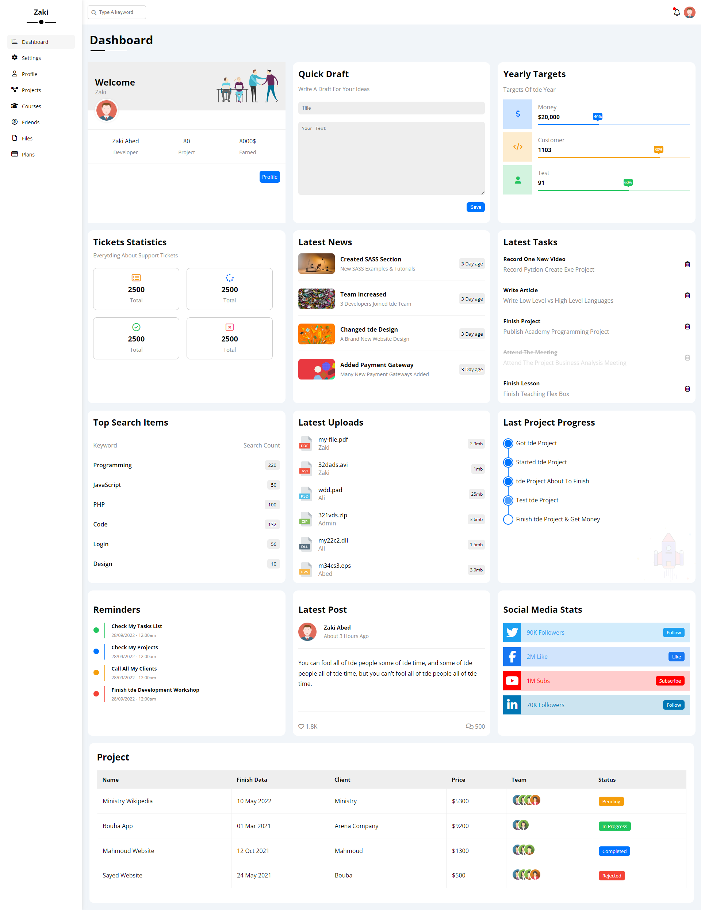
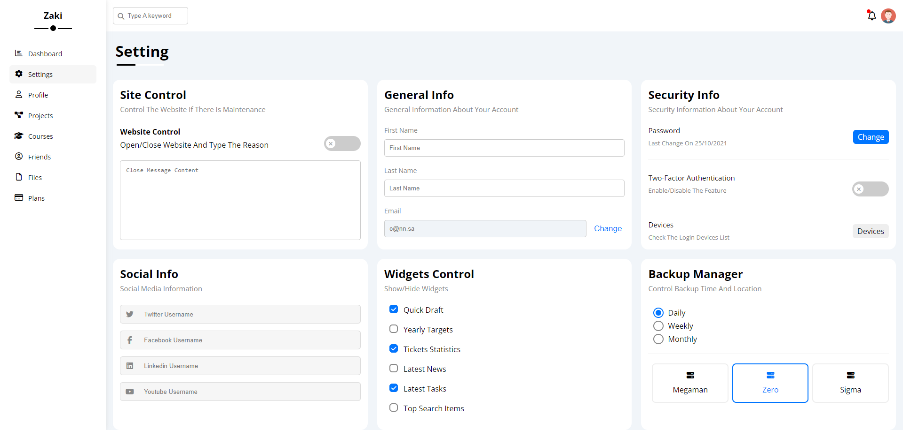
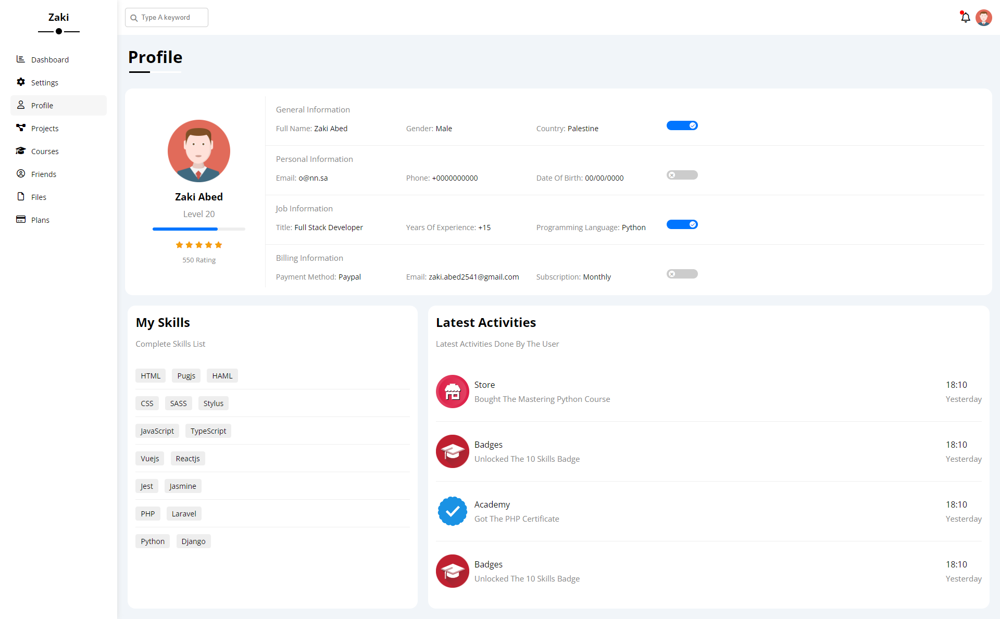
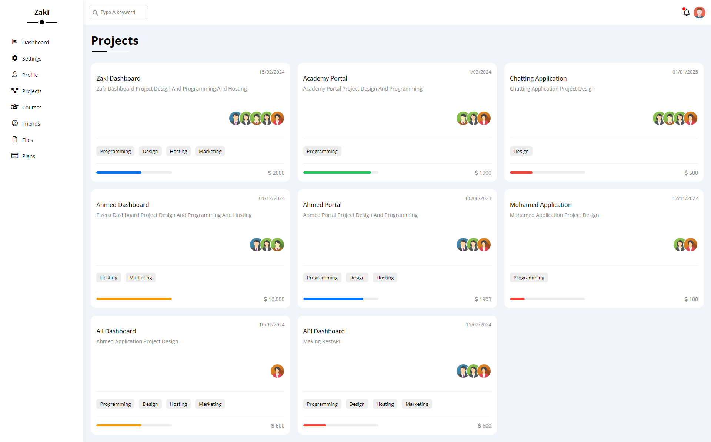
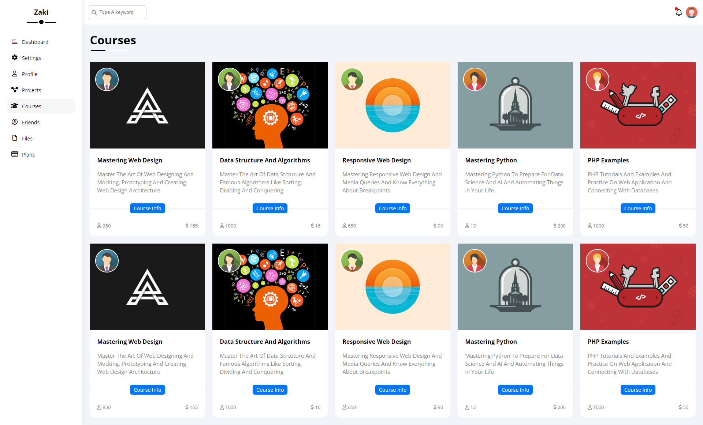
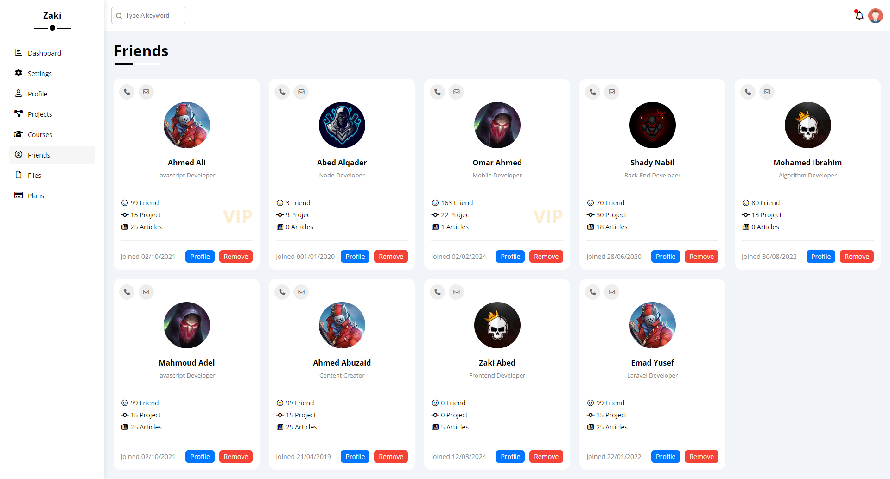
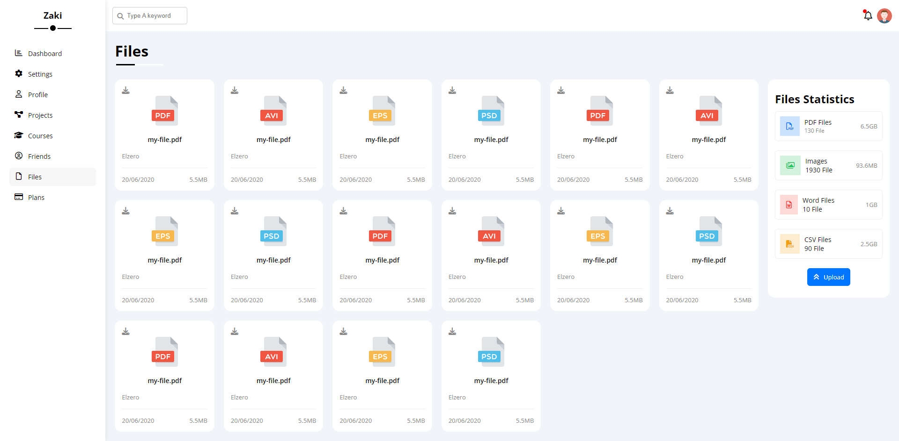
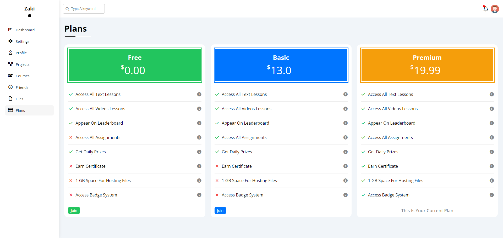

# Learning HTML & CSS: Template #4

This project is a comprehensive Dashboard application designed to provide a seamless user experience. The dashboard includes the following pages:
- **index.html:** The main landing page of the dashboard.
- **files.html:** A page for managing and organizing files.
- **friends.html:** A page to view and manage friends.
- **plans.html:** A page to view and manage plans.
- **profile.html:** A user profile page for viewing and editing user information.
- **projects.html:** A page for managing and tracking projects.
- **settings.html:** A settings page for configuring user preferences and application settings.

## Live Demo:
- [https://zaki-abed.github.io/HTML_And_CSS_Template_Four/](https://zaki-abed.github.io/HTML_And_CSS_Template_Four/)

## Screenshots
**Index Page**

**Settings Page**

**Profile Page**

**Projects Page**

**Courses Page**

**Friends Page**

**Files Page**

**Plans Page**

